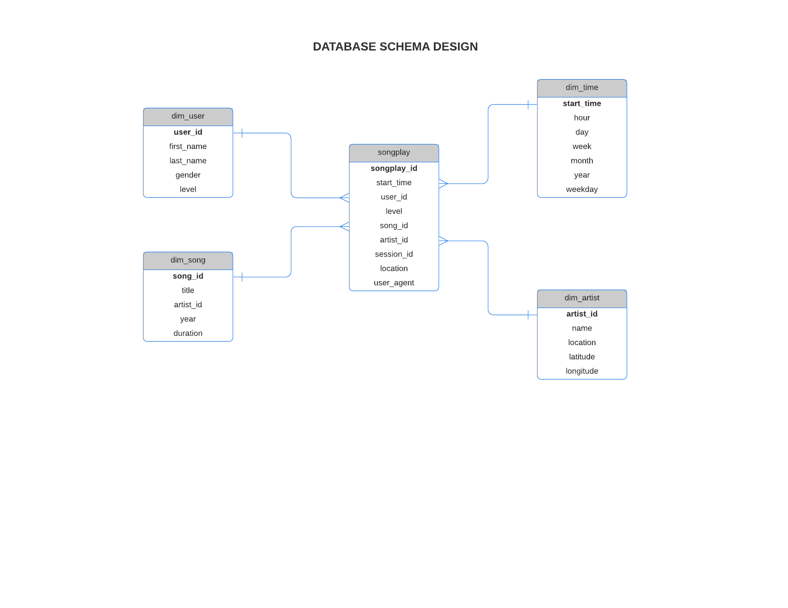

# Data Warehouse using AWS

A startup called Sparkify wants to analyze the data they've been collecting on songs and user activity on their new music streaming app. The analysis team is particularly interested in understanding what songs users are listening to. Currently, there is no easy way to query the data to generate the results, since the data reside in a directory in S3 bucket on user activity on the app.

## Overview

Project builds an ETL pipeline (Extract, Transform, Load) to create the DB and tables in AWS Redshift cluster, fetches data from JSON files stored in AWS S3, process the data, and insert the data to AWS Redshift DB.

### Technologies Used:

> 1. Python 3
>
> 1. Apache Cassandra for Modelling database
>
> 1. AWS S3 for storing data
>
> 1. AWS Redshift Cluster

## Datasets

The dataset consists of 2 datasets residing in S3 bucket in the following directory

* Song data: s3://udacity-dend/song_data
* Log data: s3://udacity-dend/log_data

### Song Dataset
The first dataset is a subset of real data from the Million Song Dataset. Each file is in JSON format and contains metadata about a song and the artist of that song. The files are partitioned by the first three letters of each song's track ID. 

### Log Dataset
The second dataset consists of log files in JSON format generated by this event simulator based on the songs in the dataset above. These simulate app activity logs from an imaginary music streaming app based on configuration settings. The file looks like this:

# Process:

## Part I Data Modeling using Apache Cassandra
Using the song and log datasets, a star schema is implemented optimized for queries on song play analysis. This includes the following tables.

### Staging Tables

* staging_events: event data telling what users have done (columns: event_id, artist, auth, firstName, gender, itemInSession, lastName, length, level, location,method, page, registration, sessionId, song, status, ts, userAgent, userId)
* staging_songs: song data about songs and artists (columns: num_songs, artist_id, artist_latitude, artist_longitude, artist_location, artist_name, song_id, title, duration, year)

### Fact Table
**songplays** - records in log data associated with song plays i.e. records with page NextSong
songplay_id, start_time, user_id, level, song_id, artist_id, session_id, location, user_agent

### Dimension Tables
**users** - users in the app
user_id, first_name, last_name, gender, level

**songs** - songs in music database
song_id, title, artist_id, year, duration

**artists** - artists in music database
artist_id, name, location, latitude, longitude

**time** - timestamps of records in songplays broken down into specific units
start_time, hour, day, week, month, year, weekday

Run the **create_table.py** file to create the tables.

## Part II. Creation of Redshift Cluster and IAM Role in AWS 
    
The file **aws.ipynb** consists of the method to create an IAM Role to provide access to the S3 bucket as well as creating a custom
Amazon Redshift cluster.

* In this example a Redshift dc2.large cluster with 4 nodes has been created, with a cost of USD 0.25/h (on-demand option) per cluster
* In this example we will use IAM role authorization mechanism, the only policy attached to this IAM will be am AmazonS3ReadOnlyAccess

Update the AWS Key and Secret in the dwh.cfg file before running

At the end of the file the endpoint and the arn of the cluster will be printed out as 
> 1. DWH_ENDPOINT
>
> 1. DWH_ROLE_ARN

## Part III ETL Pipeline for Moving the files from S3 bucket to Redshift

The ETL pipeline to load data from S3 to staging tables on Redshift and then to load data from staging tables to analytics tables on Redshift

* etl.py: Load data from S3 into staging tables on Redshift and then process that data into the tables on Redshift.
* sql_queries.py:Define SQL statements which will be imported into the two other files above.

## How to Run:

1. Update the dwh.cfg file with AWS Key and Secret for the User details
1. Run the aws.ipynb file to create a Redshift cluster and IAM Role
1. Add redshift database and IAM role info to dwh.cfg file
1. Run the create_tables.py using main.ipynb file to drop and create the tables
1. Run the etl.py using main.ipynb file to load the data after processing in the Redshift cluster
1. Run Analytical queries on your Redshift database
1. Delete the Redshift cluster and IAM Role using the aws.ipynb file

## Credits

This project was completed as part of Udacity Data Engineering Nanodegree

